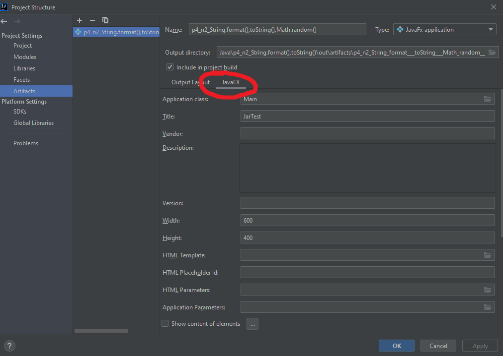

Программка с элементами интерфейса Swing, давно написанная в Eclipse на Java 1.8. Idea видит ее артефакт как JavaFX Application, при этом еще и появляется вкладка JavaFx, чего у меня не происходит с новыми проектами в Idea. Собирается успешно.

